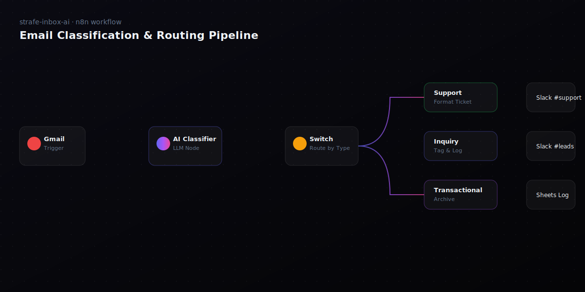

# Strafe Inbox AI

> Your inbox, intelligently sorted.

Strafe Inbox AI is an AI-powered email automation tool built on top of [n8n](https://n8n.io). It watches your Gmail, classifies every incoming email with an LLM (Support, Transactional, Inquiry, or Other), and routes it to the appropriate Slack channel as a clean, organized ticket — in under three seconds.

This repository contains the **production marketing landing page** for the product, built with Astro + TypeScript + Tailwind CSS and deployed on Netlify.



## Tech stack

- **Astro 4** — static site generation, zero JS by default
- **TypeScript** — strict-mode types for component scripts
- **Tailwind CSS** — utility-first styling, custom design tokens
- **Vanilla JS** — IntersectionObserver-driven reveal animations and the interactive demo
- **Netlify** — static hosting with edge caching
- **Google Fonts** — Inter (UI) + JetBrains Mono (code/numbers)

The product itself is built with:

- **n8n** — workflow orchestration
- **Gmail API** — email trigger
- **AI / LLM** — classification engine
- **Slack API** — ticket routing
- **Google Sheets** — historical log

## Page sections

1. Navbar — fixed, blurred, with mobile overlay menu
2. Hero — gradient headline + animated email-sorting graphic
3. Stats — animated counters (emails classified, accuracy, response time, uptime)
4. Problem — pain points and narrative
5. Features — 2x2 grid of capabilities
6. How It Works — five-step pipeline timeline
7. Demo — interactive AI classification simulator
8. Tech Stack — tools & integrations
9. Workflow — n8n diagram showcase
10. AI Employees — Claude AI + GitHub Copilot credit cards
11. About — Strafe Digital + course credit
12. Footer — minimal three-column footer

## Run locally

```bash
# 1. Install dependencies
npm install

# 2. Start the dev server (http://localhost:4321)
npm run dev

# 3. Build for production
npm run build

# 4. Preview the production build locally
npm run preview
```

## Deploy to Netlify

The repo ships with a `netlify.toml` that configures the build automatically.

**Option A — Netlify CLI**

```bash
npm install -g netlify-cli
netlify login
netlify init      # link to a new or existing site
netlify deploy --prod
```

**Option B — Connect via Netlify dashboard**

1. Push this repo to GitHub.
2. In Netlify, click **Add new site → Import an existing project** and select the repo.
3. Netlify will detect `netlify.toml` and use:
   - Build command: `npm run build`
   - Publish directory: `dist`
4. Click **Deploy site**.

That's it — every push to `main` will automatically rebuild and deploy.

## Project structure

```
strafe-inbox-ai/
├── public/
│   ├── favicon.svg
│   └── workflow-screenshot.svg
├── src/
│   ├── components/
│   │   ├── Navbar.astro
│   │   ├── Hero.astro
│   │   ├── Stats.astro
│   │   ├── Problem.astro
│   │   ├── Features.astro
│   │   ├── HowItWorks.astro
│   │   ├── Demo.astro
│   │   ├── TechStack.astro
│   │   ├── Workflow.astro
│   │   ├── AIEmployees.astro
│   │   ├── About.astro
│   │   └── Footer.astro
│   ├── layouts/
│   │   └── Layout.astro
│   ├── pages/
│   │   └── index.astro
│   └── styles/
│       └── global.css
├── astro.config.mjs
├── tailwind.config.mjs
├── tsconfig.json
├── netlify.toml
├── package.json
└── README.md
```

## Credits

- **Built by** Amari Bullard
- **Agency** Strafe Digital
- **Course** CSC150 — Introduction to AI and Analytics
- **University** University of Advancing Technology

This project was developed using AI as the development team:

- **Claude AI** — Lead Developer (UI architecture, components, documentation, classification prompts)
- **GitHub Copilot** — Code Assistant (refinement, comments, demo logic)

Project management, design direction, and review by Amari Bullard.

## License

© 2026 Strafe Digital. All rights reserved.
